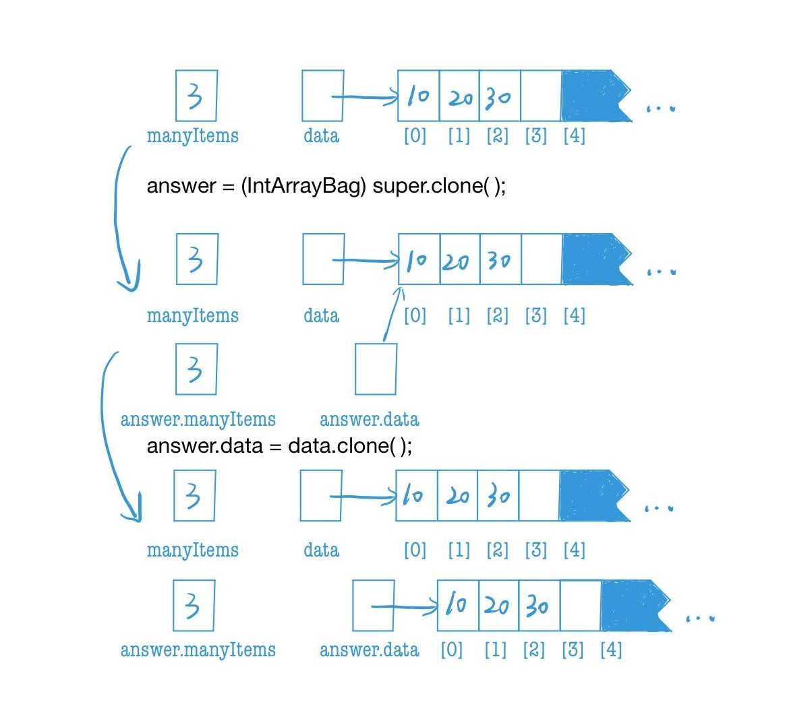

### ADT不变式

用于指示如何使用类的实例变量来表示值的规则称为ADT不变式

1. 包ADT不变式
   - 包中元素的数量存储在实例变量`manyItems`中，它的值不会超过`data.length`
   - 对于空包，我们并不关心`data`中存储的任何数据；对于非空包，报的元素存储在`data[0]`到`data[manyItems-1]`中，我们并不关心`data`中剩余部分存储的内容

2. 序列ADT不变式
   - 序列中元素的数量存储在实例变量`manyItems`中
   - 对于一个空序列（没有元素）而言，不必关心`data`中到底存放了什么；而对一个非空序列来说，序列中的元素按照从前向后的次序存储在数组的`data[0]`到`data[manyItems-1]`中，不必关心`data`中剩余部分存储的内容
   - 如果有当前元素，那么它位于`data[currentIndex]`；如果没有当前元素，那么`currentIndex`与`manyItems`相等

**为什么不将包不变式作为包方法的显式前置条件和后置条件的一部分？**

因为使用包类的程序不必知道这一信息，即信息隐藏

### 复制数组

`System.arraycopy(source, si, destination, di, n);`

参数`source`和`destination`是两个数组，其他参数为整型数。`System.arraycopy`方法从`source`中拷贝`n`个元素（从`source[si]`开始）到`destination`数组（元素从`destination[di]`开始存放，到`destination[di+n-1]`为止）。

当时我在编写`IntArrayBag.java`的`addAll(IntArrayBag addend)`方法时并没有用`System.arraycopy`方法，下面来比较一下用与不用的区别：

1. 不用`System.arraycopy`方法

   ```java
   public void addAll(IntArrayBag addend)
   {
       if(addend == null){
           throw new NullPointerException("addend is null")
       }
       for(int i = 0; i < addend.manyItems; i++){
           add(addend.data[i])
       }
       manyItems += addend.manyItems;
   }
   ```


2. 使用`System.arraycopy`方法


   ```java
   public void addAll(IntArrayBag addend)
   {
       // If addend is null, then a NullPointerException is thrown.
       // In the case that the total number of items is beyond
       // Integer.MAX_VALUE, there will be an arithmetic overflow and
       // the bag will fail.
       ensureCapacity(manyItems + addend.manyItems);
   
       System.arraycopy(addend.data, 0, data, manyItems, addend.manyItems);
       manyItems += addend.manyItems;
   }
   ```


对比这两种方式可以发现主要有两方面的区别：

- 一是运行时间，在第一种方法中会调用`addend.manyItems`次add方法，而第二种方法执行一次`System.arraycopy`方法即可。显然第二种方法运行时间更短。

- 二是异常抛出，第一种方法需要手动抛出异常，而第二种方法调用`System.arraycopy`会自动抛出异常

由此可见对于复制数组来说，`System.arraycopy`方法是非常有用且高效的。

### clone方法


```java
public IntArrayBag clone( )
{  // Clone an IntArrayBag object.
    IntArrayBag answer;

    try
    {
        answer = (IntArrayBag) super.clone( );
    }
    catch (CloneNotSupportedException e)
    {  // This exception should not occur. But if it does, it would probably
        // indicate a programming error that made super.clone unavailable.
        // The most common error would be forgetting the "Implements Cloneable"
        // clause at the start of this class.
        throw new RuntimeException
                ("This class does not implement Cloneable");
    }

    answer.data = data.clone( );

    return answer;
}
```


在类中重写clone方法，需要加上`implements Cloneable`，否则会抛出`CloneNotSupportedException`异常，这里需要注意在上面的`clone`方法最后所加的额外一行代码：`answer.data = data.clone( );`，这行代码的作用是用来生成`data`数组的独立副本，以便`clone`生成的副本使用，如果不加，那么`clone`生成的副本与原对象使用的`data`数组是相同的，如果改变了`clone`生成的副本，那原对象的`data`数组也会改变。图示如下：




